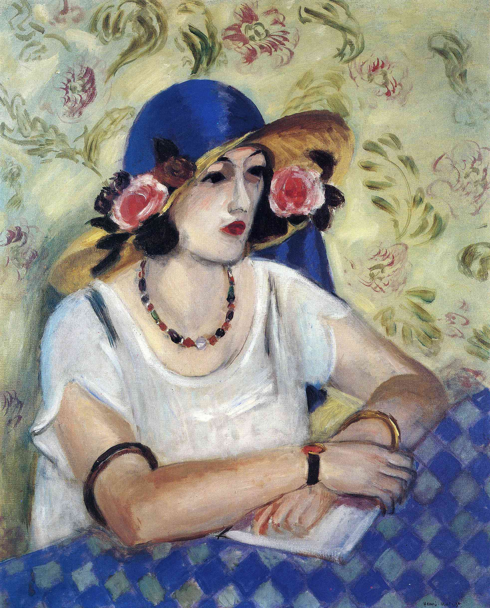
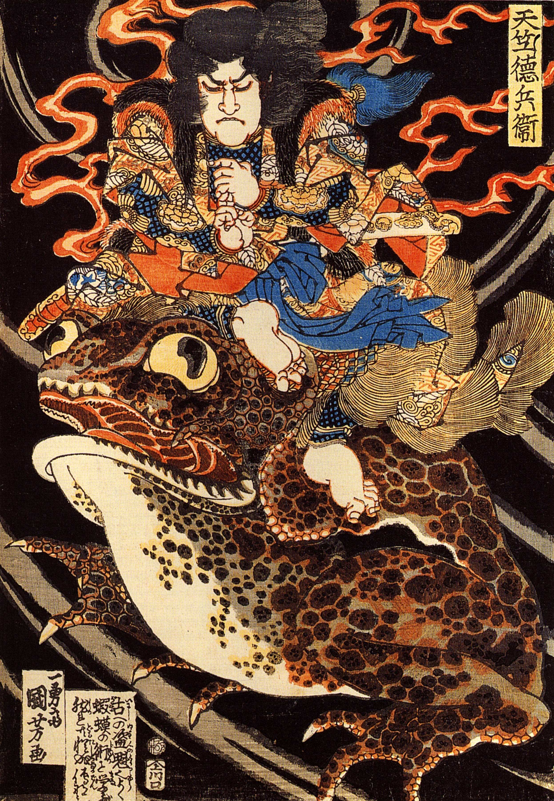
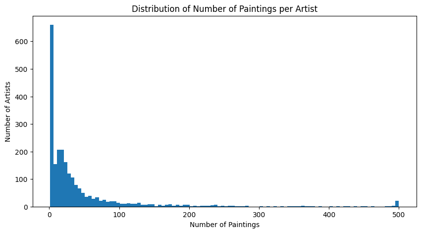
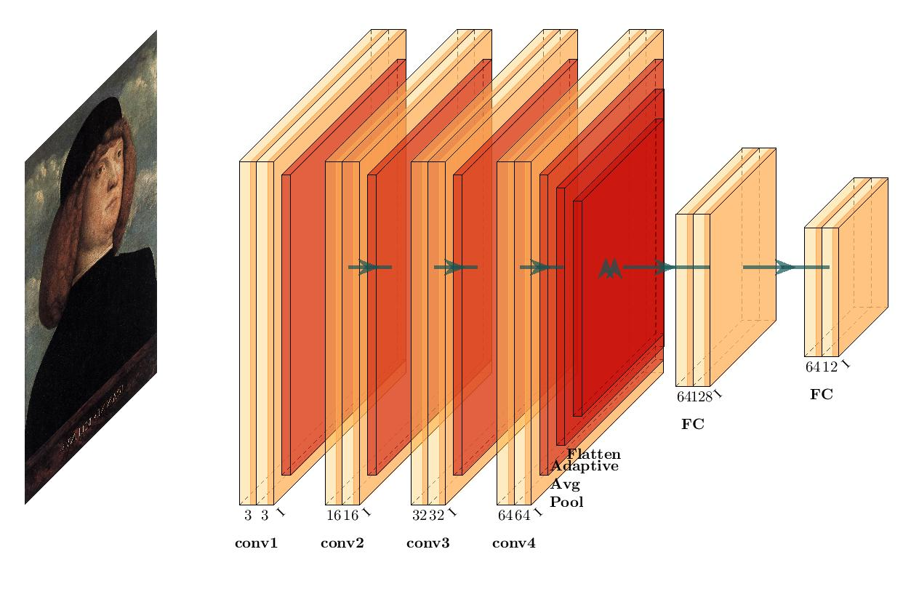

# Enhancing Art Classification: A Comparative Study of CNN, Transfer Learning, and SVM Models

## Table of Contents
- [Overview](#overview)
- [Dataset Information](#dataset-information)
- [Technology and Language](#technology-and-language)
- [Installation Instructions](#installation-instructions)
- [Usage Examples](#usage-examples)
- [Architecture and Models](#architecture-and-models)
- [Contact Information](#contact-information)

## Overview

This project aims to enhance the classification of art images through a comparative study of Convolutional Neural Networks (CNNs), Transfer Learning with ResNet50, and Support Vector Machine (SVM) models. The project explores different machine learning techniques and their effectiveness in classifying various art styles and genres, with a focus on understanding the unique characteristics of each approach.

<p align="center">
  
  
  
  
  <br>
  <em><span style="color:green">Some of the paintings used in the dataset. Works by Van Gogh, Matisse, Toyokuni, and Aivazovsky.</span></em>
</p>


## Dataset Information

The project utilizes a dataset of paintings available on [Kaggle](https://www.kaggle.com/competitions/painter-by-numbers/data), originally sourced from [WikiArt](https://www.wikiart.org). The dataset comprises images from 2319 different artists and 43 unique painting genres.

### File Descriptions

- **train.zip**: Zip file containing the images in the training set (.jpg)
- **test.zip**: Zip file containing the images in the test set (.jpg)
- **train_info.csv**: File listing image filename, artistID, genre, style, date, and title for images in the training set.
- **all_data_info.csv**: File containing additional information such as dimensions, size in bytes, artist group, etc.

### Filtering and Thresholding

The project focuses on a subset of artists, applying a threshold of 500 paintings to include an artist in the dataset. This approach ensures balanced classes, manageable model complexity, and quality representation of the artists' styles.

The filtered dataset includes the following 12 artists, representing a variety of 30 unique painting genres:

- Ivan Aivazovsky
- Gustave Dore
- Rembrandt
- Pierre-Auguste Renoir
- Albrecht Durer
- Ivan Shishkin
- Giovanni Battista Piranesi
- John Singer Sargent
- Zdislav Beksinski
- Ilya Repin
- Pablo Picasso
- Marc Chagall

Please adhere to the terms and utilize the images only for the purposes of data mining, which constitutes a form of fair use.

<p align="center">
  
  <br>
  <em>Distribution of the Number of Paintings per Artist</em>
</p>

## Technology and Language

- **Programming Language**: Python
- **Libraries**: NumPy, Pandas, Seaborn, Matplotlib, OpenCV, scikit-image, scikit-learn, Torch, torchvision
- **Platforms**: Jupyter Notebook

## Installation Instructions

1. **Python**: Ensure that Python (version 3.6 or higher) is installed on your system.
2. **Required Libraries**: Install the required libraries with the following command:

   ```bash
   pip install numpy pandas seaborn matplotlib opencv-python-headless pillow scikit-image scikit-learn torchvision torch
   ```

3. **Jupyter Notebook**: To run the provided Jupyter Notebook, install and start Jupyter:

   ```bash
   pip install jupyter
   jupyter notebook
   ```

## Usage Examples

Open the provided Jupyter Notebook (`Code_Jupyter.ipynb`) to explore the full implementation, including:

- **Data Preprocessing**: Extracting features, scaling, and splitting data.
- **Model Training**: Training CNN, SVM, and Transfer Learning models.
- **Evaluation**: Analyzing model performance.
- **Visualization**: Visualizing data and model predictions.

## Architecture and Models

### Convolutional Neural Networks (CNN)

<p align="center">
  
  <br>
  <em>Architecture of the Convolutional Neural Network used in the project</em>
</p>

The CNN model employed in this project is built with multiple convolutional layers followed by pooling layers, fully connected layers, and a softmax activation function. It is designed to automatically and adaptively learn spatial hierarchies of features from the input images.

### Transfer Learning with ResNet50

The project also explores transfer learning using the ResNet50 architecture. ResNet50 is a deep residual network that has 50 layers, including convolutional and fully connected layers. By leveraging pre-trained weights from the ImageNet dataset, the ResNet50 model is fine-tuned to adapt to the specific art classification task.

### Support Vector Machine (SVM)

The SVM model used in this study utilizes different kernel functions and hyperparameter tuning to classify the artworks based on extracted features. It serves as a comparison to understand the advantages and potential limitations of deep learning models for art classification.

## Contact Information

For inquiries or collaboration, please contact the authors:

- **Aditya Prakash**: [aditya.prakash@ucdconnect.ie](mailto:aditya.prakash@ucdconnect.ie)
- **Shreya Grover**: [shreya.grover@ucdconnect.ie](mailto:shreya.grover@ucdconnect.ie)

---

<p align="center">
  <em>Enhancing Art Classification: A Comparative Study of CNN, Transfer Learning, and SVM Models</em>
  <br>
  <em>© 2023 Aditya Prakash and Shreya Grover</em>
</p>